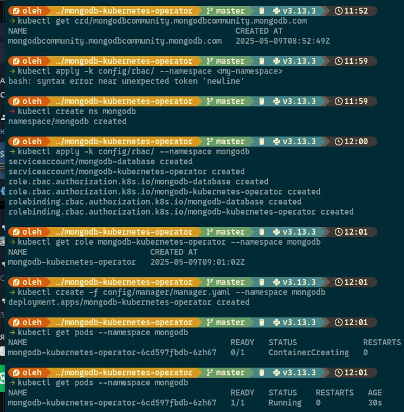

# Now "BeStrong" architecture team is considering PoC based on NoSQL solution and chose MongoDB. You will need to install MongoDB on your Minikube on your local machine, so that:

    1) Login and password are configured in MongoDB
    2) Create collection with name "BeStrong" in MongoDB
    3) When MongoDB container is rebooted, collection BeStrong should not be deleted. (persistence)
    4) After the implementation, you will have a demo (in English ofc) to present this solution to the client, and explain your architecture decisions.

## Installing MongoDB K8s Operator:

