# Now "BeStrong" architecture team is considering PoC based on NoSQL solution and chose MongoDB. You will need to install MongoDB on your Minikube on your local machine, so that:

    1) Login and password are configured in MongoDB
    2) Create collection with name "BeStrong" in MongoDB
    3) When MongoDB container is rebooted, collection BeStrong should not be deleted. (persistence)
    4) After the implementation, you will have a demo (in English ofc) to present this solution to the client, and explain your architecture decisions.

## Installing MongoDB K8s Operator:

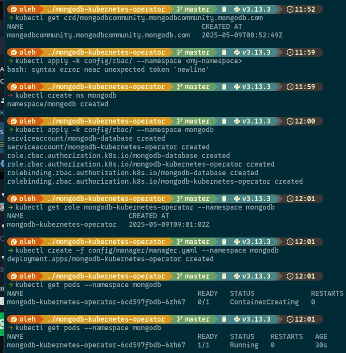

## After that we need to apply the configuration
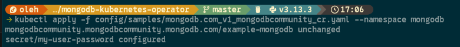

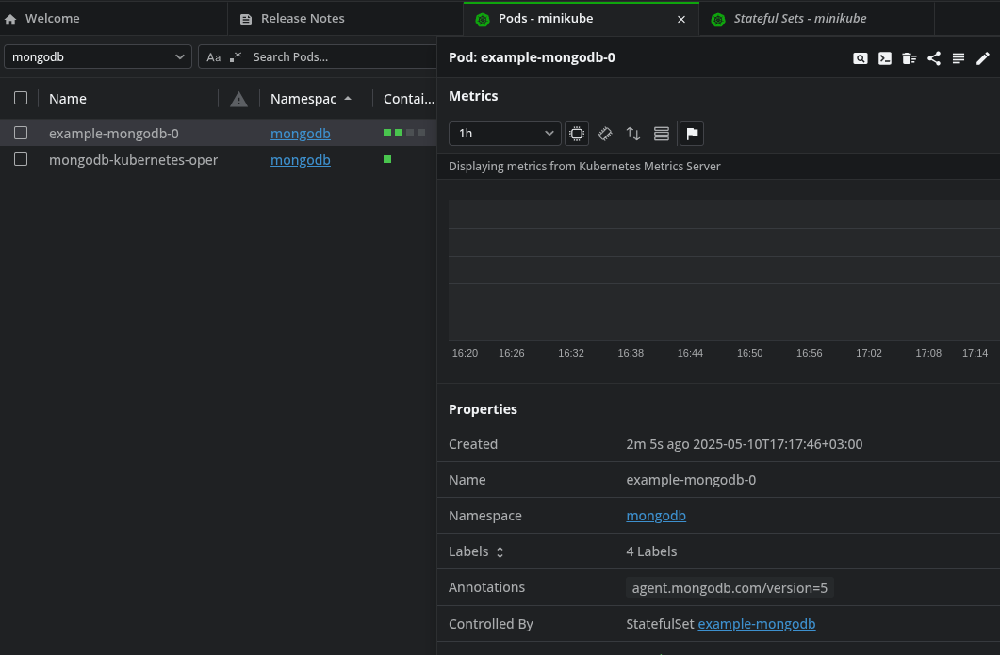

####  We can check that our pods is running and configuration has been deployed successfully!

### We need to forward port in order to connect to our database from outside
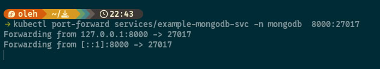
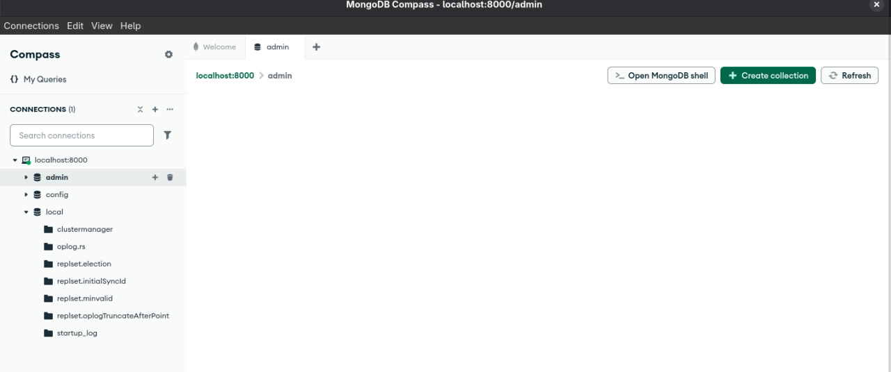

### And create user that can create collections, have read-write permission:
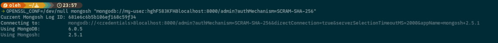
#### To do that we have to connect to mongobd directly from pod and add the rules: 
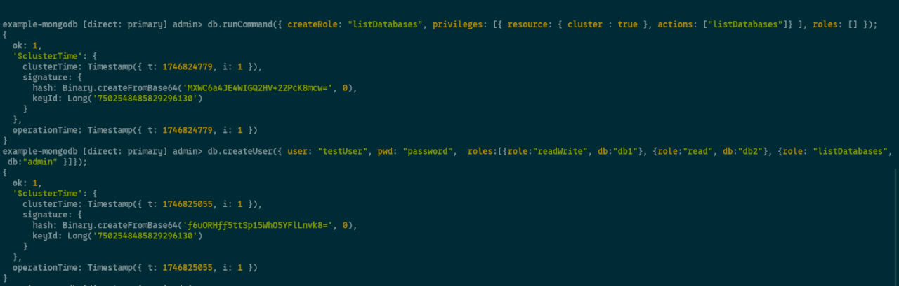

### Creation of collection BeStrong in MongoDB Compass GUI
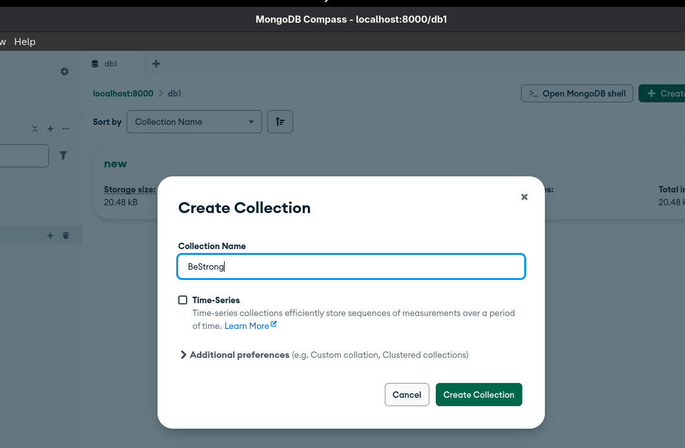
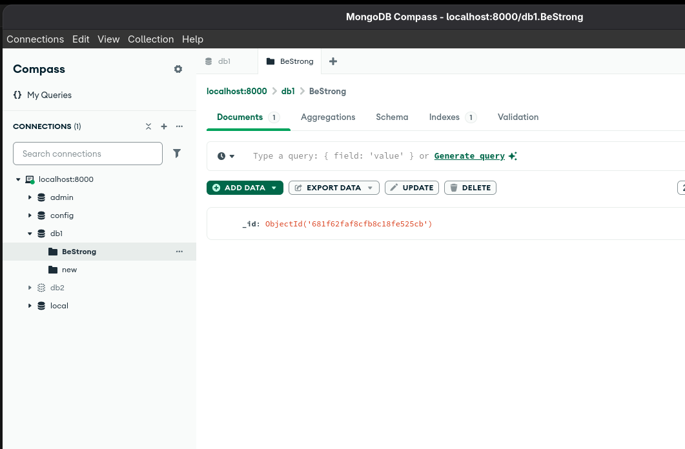

### After deleting pod and re-applying the configuration data is persistent and safe
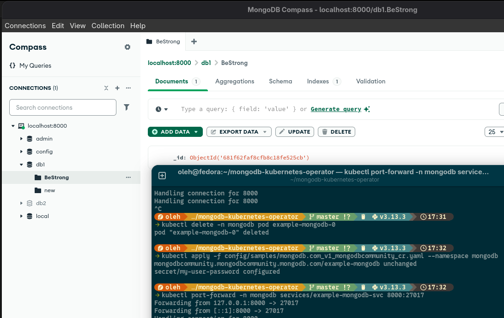

### Advantages of architecture decisions:
Using MongoDB K8s Operator gives us stablity and great integration with Kubernetes. It simplifies operations like provisioning, scaling, backup. Our data is persistant.

### Diagram of deployment:
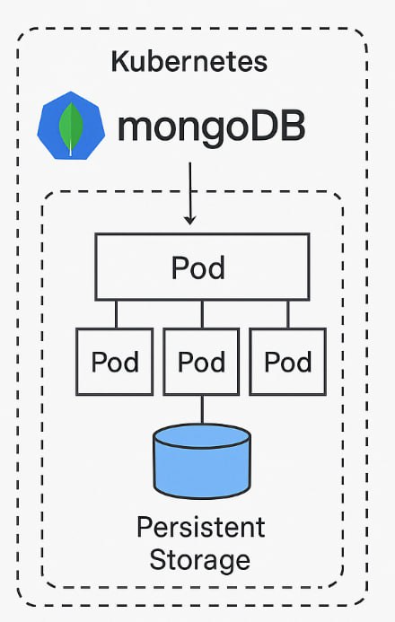